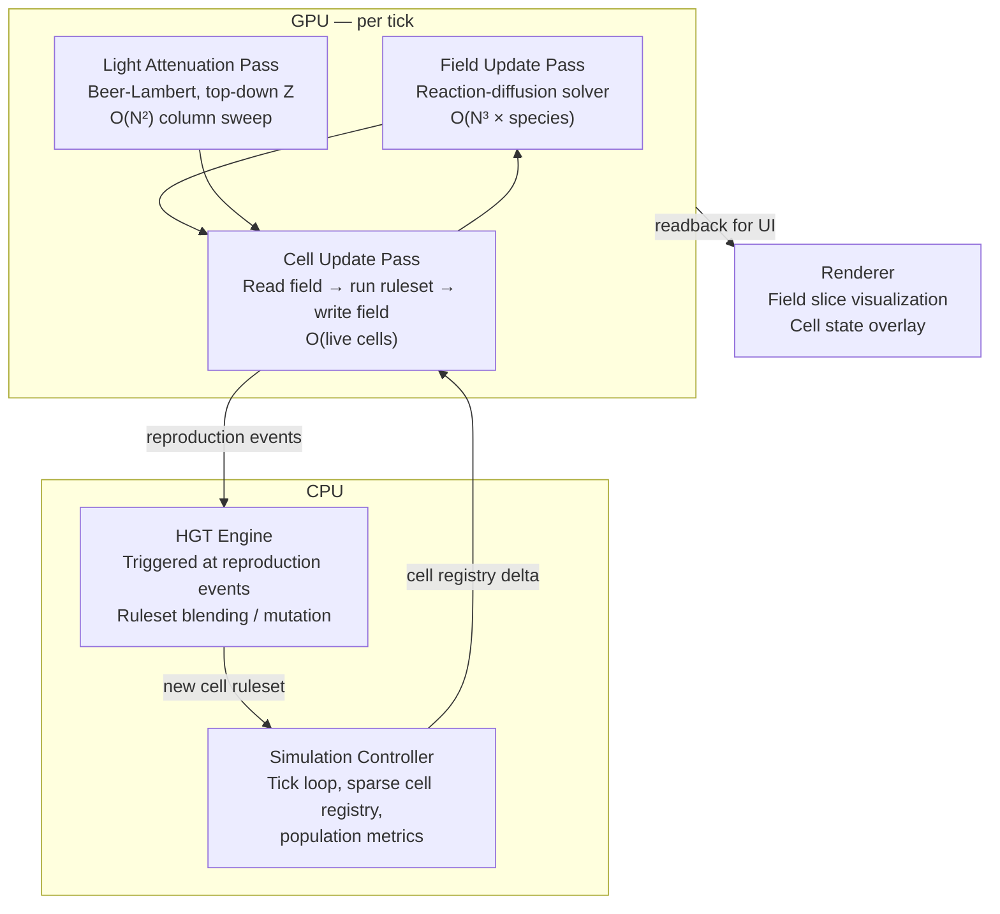

# Architecture

## System Diagram



---

## Component Inventory

### Field Update Pass
The primary physics layer. Runs unconditionally every tick across all 50M voxels regardless of cell presence. Computes the discrete 3D Laplacian for each chemical species, applies diffusion, decay, and source terms. All field math is uniform — same instruction across all voxels — making this the GPU-friendly component of the system.

**Inputs:** chemical concentration buffer (t), cell secretion/consumption buffer  
**Outputs:** chemical concentration buffer (t+1)  
**Dependencies:** none  
**Compute cost:** O(N³ × species); dominant memory bandwidth consumer. ~7-13 ms/tick on RTX 4060 via 2.5D streaming tiling. See [[research-gpu-field-update]]

### Light Attenuation Pass
Runs once per tick, top-down sweep along the Z axis. Computes a per-column Beer-Lambert integral: intensity decays exponentially as a function of cumulative cell density and chemical absorber concentration above each voxel. Writes a light availability scalar into a dedicated field channel. Cells read this channel as an energy source input.

**Inputs:** cell density field, absorber concentration field  
**Outputs:** light availability field  
**Dependencies:** field update pass (absorber concentrations current)  
**Compute cost:** O(N² × Z); cheap relative to field update

### Cell Update Pass
Sparse. Only voxels containing live cells are processed. Each cell reads its local chemical concentrations (external field), runs its ruleset, and writes secretion/consumption deltas back to the field. May trigger reproduction (daughter placed in adjacent empty voxel), quiescence, or apoptosis. Internal concentration vector updated per cell per tick via a small per-cell ODE.

**Inputs:** chemical field (read), light field (read), cell registry  
**Outputs:** secretion/consumption delta buffer, reproduction event queue  
**Dependencies:** field update pass, light pass  
**Compute cost:** O(live cells × ruleset complexity); cheap if cells remain sparse

### HGT Engine
CPU-side. Processes the reproduction event queue from the cell update pass. On division, the daughter ruleset is generated by: (1) copying parent ruleset, (2) applying stochastic point mutations to response parameters, (3) optionally blending with ruleset(s) of neighboring cells weighted by adjacency and a transfer probability. The transfer probability is itself a mutable ruleset parameter, allowing HGT propensity to evolve.

**Inputs:** reproduction event queue, neighbor ruleset reads  
**Outputs:** daughter cell rulesets  
**Dependencies:** cell registry  
**Compute cost:** O(reproduction events per tick); negligible under sparse cell regimes

### Renderer
Reads field slices and cell state for visualization. Not on the critical tick path — decoupled from simulation rate. Renders chemical concentration as volumetric color fields (per-species color mapping), cell positions as overlaid point cloud, light field as optional overlay. Slice plane controllable interactively.

---

## Data Flow

```
tick N field state
    → Field Update Pass → tick N+1 field state
    → Light Attenuation Pass → light field
    → Cell Update Pass → secretion deltas + reproduction queue
        → secretion deltas fold into tick N+2 field sources
        → reproduction queue → HGT Engine → new cells registered
```

---

## Key Design Constraints

**Field-mediated interaction only.** Cells do not have explicit neighbor lists. All cell-cell communication is indirect, through chemical concentration gradients in the shared field. Direct cell-cell contact is not modeled structurally — it can emerge if two cells are adjacent and chemically motivated to remain so, but nothing in the architecture presumes or enforces it.

**Sparse cell representation.** Cells live in a hashmap keyed on voxel coordinates. The dense chemical field is always fully allocated; cells are not. This preserves O(1) field access patterns for GPU shaders while keeping cell-side memory proportional to actual population.

**Rulesets are per-cell, not global.** Every cell carries its own ruleset (~314 bytes, B+E hybrid format). This is the source of evolutionary diversity. GPU batching is achieved by construction: all cells execute the same fixed-length loop structure (S=8 receptors, S=8 transporters, R_MAX=16 reactions, S=8 effectors) with no branching on cell identity. Inactive reactions (v_max=0) are evaluated as no-ops within the fixed loop, maintaining SIMD coherence regardless of metabolic diversity.

**Timescale abstraction: 1 tick ≈ 1 day.** The simulation targets geological/ecological timescales, not molecular dynamics. Diffusion parameters are set to gel-phase values (10–100× slower than free solution). This satisfies numerical stability constraints for the chosen timestep without requiring implicit integration. Evolution events (mutation, HGT) occur only at reproduction, not continuously.

**Autocatalytic bootstrapping via epsilon background rate.** All intracellular reactions proceed at a small uncatalyzed background rate (epsilon = 0.001, or 0.1% of max catalytic rate) even without their catalyst species present. This solves the chicken-and-egg problem of metabolism bootstrapping while preserving the 1000x evolutionary advantage of functional catalysis. See [[research-bootstrapping]] and [[mock-winogradsky-scenario]] for detailed analysis.

**Species count: S=12 external, M=16 internal (proposed).** The initial design used S=M=8, which proved tight for the Winogradsky scenario (5 metabolites + 2 signals + 1 structural = 8, zero headroom). S=12 provides 5 metabolites + 3 signals + 2 structural + 2 reserve at a VRAM cost of ~2.9 GB with sparse delta buffer (36% of 8 GB). M=16 provides 12 internalized external chemicals + 4 dedicated enzyme/intermediate slots. Shared memory constraints limit S to ~12 without tiling strategy redesign. See [[Decisions/006-species-namespace-count]].

**Energy currency: internal species 0.** Energy is a hardcoded distinguished internal species. All cells use `internal_conc[0]` for fate decisions (division, quiescence, death) with evolvable thresholds. A fixed per-tick maintenance drain (`lambda_maintenance = 0.02`) ensures that cells must actively produce energy to survive. Energy is intracellular only -- it does not exist in the external field. See [[Decisions/007-energy-currency]].

**Niche construction via diffusion modification (planned).** Cells that secrete the structural-deposit species modify the local diffusion coefficient, creating self-organized biofilm structure. Implementation: D_local = D_base * (1 - alpha * structural/(K_eps + structural)). Zero additional VRAM. One extra multiply-add per voxel per species per tick. See [[exploration-novel-extensions]].

**Voxel size: dx = 100 um.** The grid represents a 5 cm x 5 cm x 2 cm physical volume -- approximately the size of a laboratory Winogradsky column. Gel-phase diffusion crosses ~40 voxels per tick at this scale.

**Vertical asymmetry is the only spatial asymmetry.** The grid is isotropic in X and Y. The Z axis is privileged by two mechanisms: light attenuation (top-down) and optional gentle chemical sedimentation (slow downward drift term on dense secreted compounds). No other directional bias is imposed.

---

## Explicit Anti-Features

**No fitness function.** Fitness is never computed, stored, or optimized. Selection is a post-hoc emergent property of chemical self-consistency.

**No explicit cell-cell adhesion.** Adhesion-like clustering, if it appears, must emerge from chemical gradient dynamics.

**No advection / fluid flow.** The medium is solid-phase. Diffusion is the only transport. This is not an approximation — it is the correct physics for the targeted biological regime (biofilm / microbial mat).

**No predefined cell types.** Cell phenotype is entirely a function of current ruleset and internal state. No cell type taxonomy is hardcoded.

**No periodic boundary conditions (tentative).** Hard walls at all six faces with zero-flux boundary conditions (Neumann). Prevents artificial toroidal topology from influencing spatial structure. Revisit if edge effects become a confound.
